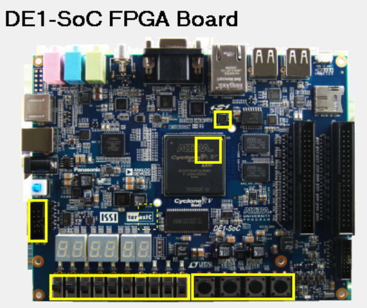

# Atividade 5 - SPI Interface and ADC Communication on DE1-SoC


[](https://github.com/joaosnet/Atividade5/blob/master/README.md)

## Project Description

This project configures SPI communication with an ADC on the DE1-SoC, involving ADC sampling control via button input, proper pin mapping, and possibly a top-level file for integrating SPI and PIO to the configured ports. The configuration uses Quartus Prime Lite 17.0 and VHDL for hardware description, enabling data acquisition from an external ADC.

## Technologies Used


# Index

- [Project Description](#project-description)
- [Screenshots](#screenshots)
- [Architecture](#architecture)
- [Objectives](#objectives)
    - [General](#general)
    - [Specific](#specific)
- [Contributors](#contributors)
- [Project Slides](#project-slides)
- [Getting Started](#getting-started)
- [Build Instructions](#build-instructions)
- [Running in Background](#running-in-background)

## Screenshots



_Description of screenshots._


_Captured samples._


_qsys._

## Architecture


_Description of the architecture._

## Objectives

### General

Establish SPI communication for ADC data sampling using DE1-SoC.

### Specific

1. Configure SPI pins for ADC connection.
2. Implement button-triggered sampling.
3. Develop and test VHDL code in Quartus 17.

### Future Improvements

The project is under development; future updates will include:

- [x] Initial SPI setup.
- [ ] Complete sampling logic.
- [ ] Integrate and verify hardware connections.

## 🤝 Contributors

<table>
    <tr>
        <td align="center">
            <a href="https://www.instagram.com/jaonativi/" title="Project Manager Backend Developer">
                <br>
                <sub>
                    <b>João Natividade</b>
                </sub>
            </a>
        </td>
    </tr>
</table>

## Getting Started

### Prerequisites

Ensure Quartus Prime Lite 17.0 is installed.

### Installation

1. Clone this repository:
   ```bash
   git clone https://github.com/joaosnet/Atividade5.git
   ```
2. Open the project in Quartus.

### Running in Background

Use the Quartus CLI for build processes in the background on Linux.
