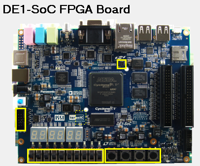
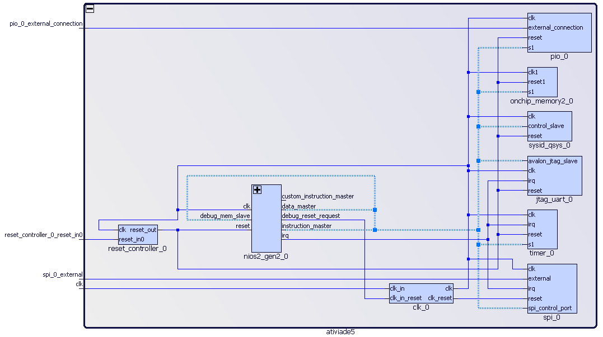

# Atividade 5 - Interface SPI e Comunicação ADC na DE1-SoC


[](https://github.com/joaosnet/Atividade5/blob/master/README.pt-br.md)

## Descrição do Projeto

Este projeto configura a comunicação SPI com um ADC na DE1-SoC, incluindo controle de amostragem do ADC por botão, mapeamento adequado dos pinos e possivelmente um arquivo top-level para integrar o SPI e o PIO às portas configuradas. A configuração utiliza Quartus Prime Lite 17.0 e VHDL para a descrição de hardware.

## Tecnologias Utilizadas


# Índice

- [Descrição do Projeto](#descrição-do-projeto)
- [Capturas de Tela](#capturas-de-tela)
- [Arquitetura](#arquitetura)
- [Objetivos](#objetivos)
    - [Geral](#geral)
    - [Específicos](#específicos)
- [Contribuidores](#contribuidores)
- [Slides do Projeto](#slides-do-projeto)
- [Começando](#começando)
- [Instruções de Build](#instruções-de-build)
- [Execução em Segundo Plano](#execução-em-segundo-plano)

## Capturas de Tela



_Descrição das capturas de tela._

## Arquitetura



_Descrição da arquitetura._

## Objetivos

### Geral

Estabelecer comunicação SPI para amostragem de dados ADC usando a DE1-SoC.

### Específicos

1. Configurar os pinos SPI para conexão ADC.
2. Implementar a amostragem acionada por botão.
3. Desenvolver e testar o código VHDL no Quartus 17.

### Melhorias Futuras

O projeto está em desenvolvimento; futuras atualizações incluirão:

- [x] Configuração inicial do SPI.
- [ ] Completar lógica de amostragem.
- [ ] Integrar e verificar conexões de hardware.

## 🤝 Contribuidores

<table>
    <tr>
        <td align="center">
            <a href="https://www.instagram.com/jaonativi/" title="Project Manager Backend Developer">
                <br>
                <sub>
                    <b>João Natividade</b>
                </sub>
            </a>
        </td>
    </tr>
</table>

## Começando

### Pré-requisitos

Certifique-se de ter o Quartus Prime Lite 17.0 instalado.

### Instalação

1. Clone o repositório:
   ```bash
   git clone https://github.com/joaosnet/Atividade5.git
   ```
2. Abra o projeto no Quartus.

### Execução em Segundo Plano

Use a CLI do Quartus para processos de build em segundo plano no Linux.